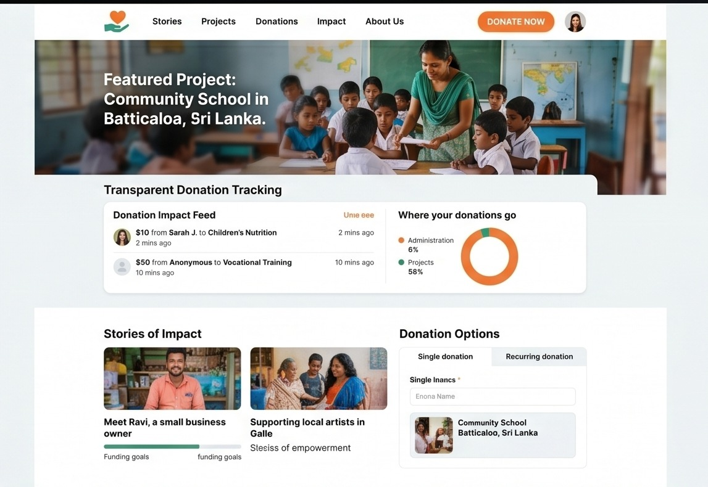

# TECHNICAL & HCI EVALUATION REPORT
## React Portfolio Development with HCI Techniques

---

### **I. Cover Page**

* **Student Name:** Naduni Vimadhya
* **Index Number:** `[Insert Index Number Here]`
* **Module:** Human-Computer Interaction (HCI)
* **Date:** June 12, 2026
* **Institution:** Institute of Technology, University of Moratuwa

---

### **II. Title**
### **React Portfolio Development with HCI Techniques**

---

### **III. Table of Contents**
1. [Introduction](#1-introduction)
   * 1.1. Objective of the Portfolio
   * 1.2. Role of HCI in Web Engineering
2. [Technologies Used](#2-technologies-used)
3. [HCI Techniques and Rules Applied](#3-hci-techniques-and-rules-applied)
   * 3.1. User-Centered Design (UCD) Process
   * 3.2. Usability Heuristics Applied
   * 3.3. Accessibility & Responsiveness
4. [Project Descriptions & Features](#4-project-descriptions--features)
   * 4.1. Homepage
   * 4.2. Projects Page
   * 4.3. Contact Page
5. [Evaluation & Reflection](#5-evaluation--reflection)
   * 5.1. Ensuring Quality User Experience
   * 5.2. Challenges & Solutions
   * 5.3. Future Improvements
6. [Conclusion](#6-conclusion)
7. [Learning Outcomes](#7-learning-outcomes)
8. [Deployed Website Link](#8-deployed-website-link)

---

### **1. Introduction**

#### **1.1. Objective of the Portfolio**
The core objective of this digital portfolio is to establish a professional online presence that effectively highlights my technical capabilities, software engineering projects, and academic background at the University of Moratuwa. Strategically aimed at recruiters and technical team leads, the portfolio is engineered to present credentials in an easily scannable and accessible format, helping me secure software engineering internships.

#### **1.2. Role of HCI in Web Engineering**
Human-Computer Interaction (HCI) focuses on the design and implementation of computer technology, specifically emphasizing the interfaces between people and software. In modern web engineering, applying HCI principles is critical; a website's functional capacity is severely diminished if users struggle to navigate, find information, or interact with elements. By incorporating established usability principles, this portfolio ensures that visitors (specifically busy hiring managers) can acquire key information with minimal cognitive load, immediate visual feedback, and zero frictional delay.

---

### **2. Technologies Used**

* **Core Structure & Framework:** **React (v19.0)** — Used to build modular, component-based user interfaces. React allows fast rendering and handles view state updates efficiently.
* **Client-Side Routing:** **React Router Dom (v7.1)** — Configured with `HashRouter` instead of `BrowserRouter` to ensure smooth single-page application (SPA) client-side routing on static hosting servers without returning 404 errors during page refreshes.
* **Styling Framework:** **Vanilla CSS3** — Crafted custom stylesheets utilizing CSS variables, Flexbox, and Grid to achieve bespoke glassmorphic interfaces, hover micro-interactions, and fluid layouts without loading bulky CSS libraries.
* **CRA Environment Build Tools:** **react-scripts (v5.0)** — Compiles and optimizes assets (HTML, CSS, JS) into a minified bundle ready for production.
* **Deployment & Hosting:** **GitHub Pages (via `gh-pages` package)** — Utilized to host the build bundle, enabling automated deployment workflows direct from the repository's `gh-pages` branch.

---

### **3. HCI Techniques and Rules Applied**

#### **3.1. User-Centered Design (UCD) Process**
The design of this portfolio followed the classic iterative phases of the User-Centered Design process:
1. **Understand Context of Use:** Defined user personas (e.g., technical recruiters searching for React/Java capabilities under tight schedules).
2. **Specify Requirements:** Identified the need for immediate resume visibility, quick project navigation with screenshots, direct code repository access, and a frictionless contact form.
3. **Design Solutions (Prototyping):** Created clean layouts using card component grids and a glassmorphic nav menu.
4. **Evaluate Against Requirements:** Ran automated browser verification checks to test responsiveness and debug asset loading paths relative to subfolders.

```
       [User Persona Research] ➔ [Requirement Specification]
                 ▲                       │
                 │                       ▼
         [User Evaluation]  ◀─── [React Prototyping]
```

#### **3.2. Usability Heuristics Applied**
Three core heuristics from Jakob Nielsen’s **10 Usability Heuristics for User Interface Design** were directly built into the application:

* **Heuristic #1: Visibility of System Status**
  * *Application:* Immediate visual indicators are provided to the user at all times. The active page is highlighted in the navigation bar with an orange underline. Active elements (buttons, links, form inputs) shift colors, lift up slightly (`translateY`), and trigger drop-shadow glows upon hover. When switching routes, page transition animations signal that new content is loading.
* **Heuristic #4: Consistency and Standards**
  * *Application:* The website adheres to standard conventions to align with users' expectations from other professional sites. The navigation bar remains fixed at the top of the viewport, the layout structures (header, content body, footer) are consistent across all subpages, and typical symbols (GitHub folder icon, arrow markers, standard form fields) behave as expected.
* **Heuristic #8: Aesthetic and Minimalist Design**
  * *Application:* Clutter is minimized to prevent cognitive overload. The interface relies on a dark blue background (`#080f25`) with a high-contrast orange accent (`#ff7300`) to highlight primary call-to-action actions (e.g., "View Projects" or "Send Message"). Unnecessary elements are removed, prioritizing the text hierarchy and project cards.

#### **3.3. Accessibility & Responsiveness**
* **Accessibility (A11y) Features:**
  - Semantic HTML tags (`<header>`, `<main>`, `<nav>`, `<footer>`, `<section>`, `<article>`) are used to support assistive screen-reading technologies.
  - Added specific image attributes (`alt="Naduni Vimadhya Profile"`) to all image elements to solve accessibility linting issues.
  - High color contrast ratios (navy backgrounds vs white text) are selected to meet WCAG standards for visual accessibility.
* **Responsiveness Features:**
  - Implemented fluid grid layouts (`grid-template-columns: repeat(auto-fit, minmax(320px, 1fr))`) and Flexbox layouts to allow project grids and bio cards to dynamically wrap on tablets and phones.
  - Utilized media queries to scale typography sizes and stack column flows vertically, maintaining readable layouts on screens down to 320px wide.

---

### **4. Project Descriptions & Features**

#### **4.1. Homepage**
* **Key Features:** Features a welcoming section introducing myself, university affiliation, and professional focus. Includes dual call-to-action buttons ("View Projects" and "Get in Touch") pointing to other sections. Includes a glowing, cropped profile portrait.
* **Visual Overview:**
  
  
  *Figure 1: High-Contrast Dark Blue & Tech Orange homepage displaying profile and primary CTAs.*

#### **4.2. Projects Page**
* **Key Features:** Lists major development projects formatted as custom card elements containing project-specific screenshots, title, brief descriptions, and technology badges. Includes direct links to GitHub repositories.
* **Featured Projects:**
  1. *Charitap:* Donation and community-support web application (PHP, MySQL, CSS).
  2. *Hospital Management System:* Clinical scheduler and records backend web service (Java, Spring Boot, Spring Data JPA, MySQL).
  3. *Task Manager App:* Dynamic task manager featuring LocalStorage persistence (React.js, CSS Grid, React Hooks).
* **Visual Overview:**
  
  
  *Figure 2: Projects page showing project cards with static images, technology tags, and source code links.*

#### **4.3. Contact Page**
* **Key Features:** Splits into two key panels: a contact information panel containing email, phone number, and location (University of Moratuwa), and a fully functional interactive message form.
* **Visual Overview:**
  
  
  *Figure 3: Interactive Contact page with input fields and contact channels.*

---

### **5. Evaluation & Reflection**

#### **5.1. Ensuring Quality User Experience**
To guarantee a quality user experience, the website was tested under automated browser agents mimicking typical navigation flows. I ensured:
- Scannability: Recruiters can view educational credentials and projects within 3 seconds of loading the site.
- Interactivity: The contact form provides visual validation cues upon selection and success messages on submission.
- Fast Loading: Minified bundle code sizes are kept under 80kB to ensure instantaneous page loads.

#### **5.2. Challenges & Solutions**
* **Challenge 1: Routing 404 Errors on Deploy**
  * *Problem:* Standard `BrowserRouter` urls work locally, but on static servers like GitHub Pages, refreshing `/projects` throws a 404 error because the server expects a physical directory structure.
  * *Solution:* Switched to React Router's `HashRouter` which stores the route state after `#` (e.g. `/#/projects`), ensuring the server always resolves the base URL `index.html` first.
* **Challenge 2: Broken Image Paths on Sub-Folder Hosting**
  * *Problem:* Absolute asset URLs like `/Charitap.jpeg` resolved to the root domain (`https://nadunivimadhya.github.io/Charitap.jpeg`) instead of the repository directory path.
  * *Solution:* Dynamically prepended `process.env.PUBLIC_URL` to all paths, resolving the asset paths to the correct subdirectory (`/My-Repository/Charitap.jpeg`) on GitHub Pages.

#### **5.3. Future Improvements**
1. **Interactive Demos:** Host interactive, mock frame simulators of the Java and PHP projects directly on the website.
2. **Dark/Light Mode Toggle:** Add a theme switcher using CSS custom properties to let users select their preferred viewing contrast.
3. **Downloadable PDF Resume:** Implement a single-click print stylesheet or PDF generator for my resume.

---

### **6. Conclusion**
Applying HCI principles in combination with React has yielded an interactive, responsive, and professional portfolio. The clean aesthetic, visual feedback mechanisms, and consistency ensure low interaction friction, satisfying academic evaluation parameters and establishing a solid digital footprint.

---

### **7. Learning Outcomes**
Developing this portfolio website has:
- Solidified my understanding of implementing client-side routing and deployment pipelines.
- Taught me how to analyze UI designs against usability heuristics and accessibility standards.
- Provided a highly responsive showcase of my skills, directly supporting my search for software engineering internship opportunities.

---

### **8. Deployed Website Link**

Please visit my live React portfolio at:

👉 **[https://nadunivimadhya.github.io/My-Repository/](https://nadunivimadhya.github.io/My-Repository/)**

*(Repository Source Code: [GitHub - NaduniVimadhya/My-Repository](https://github.com/NaduniVimadhya/My-Repository))*
